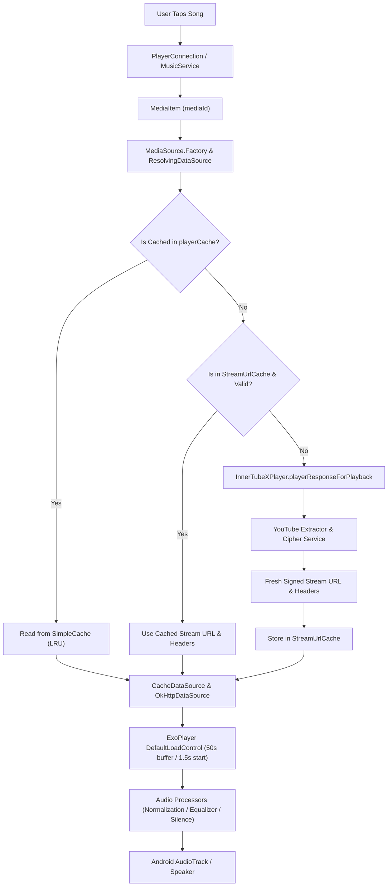

# Audio Streaming and Playback Architecture Analysis (Mixify / Mixify)

This document provides a deep, code-backed technical analysis of how **Mixify (Mixify)** handles audio fetching, streaming, caching, and playback coordination through ExoPlayer / Media3 and the InnerTube extraction pipeline.

---

## 1. Complete Playback Flow: User Tap to Speaker

When a user taps a song in the UI, the playback request traverses the following architectural layers:

1. **User Action & Dispatch**:
   - The user clicks a track in UI components (e.g., [Player.kt](file:///C:/Users/prod/Downloads/Mixify-main/app/src/main/kotlin/com/mixify/music/ui/player/Player.kt), `PlayerMenu.kt`) or playlists.
   - Dispatches a play request to [PlayerConnection.kt](file:///C:/Users/prod/Downloads/Mixify-main/app/src/main/kotlin/com/mixify/music/playback/PlayerConnection.kt) which communicates with [MusicService.kt](file:///C:/Users/prod/Downloads/Mixify-main/app/src/main/kotlin/com/mixify/music/playback/MusicService.kt) via MediaController / MediaSession.

2. **MediaItem & MediaSource Creation**:
   - [MusicService.kt](file:///C:/Users/prod/Downloads/Mixify-main/app/src/main/kotlin/com/mixify/music/playback/MusicService.kt) receives the `MediaItem` containing the `mediaId` (YouTube video ID).
   - `MediaSource.Factory` interceptor ([MusicService.kt#L4140](file:///C:/Users/prod/Downloads/Mixify-main/app/src/main/kotlin/com/mixify/music/playback/MusicService.kt#L4140)) creates the appropriate media source (handling audio vs video song merging if applicable).

3. **URL Resolution & Caching (`ResolvingDataSource`)**:
   - When ExoPlayer attempts to load data, `ResolvingDataSource` ([DownloadUtil.kt#L70](file:///C:/Users/prod/Downloads/Mixify-main/app/src/main/kotlin/com/mixify/music/playback/DownloadUtil.kt#L70)) intercepts the `DataSpec`.
   - It checks if the requested byte range is already present in `playerCache` (`SimpleCache`).
   - If cached locally, it bypasses network resolution.
   - If a cached stream URL exists in `StreamUrlCache` ([StreamUrlCache.kt](file:///C:/Users/prod/Downloads/Mixify-main/app/src/main/kotlin/com/mixify/music/playback/StreamUrlCache.kt)), it resolves immediately.
   - Otherwise, it queries `InnerTubeXPlayer.playerResponseForPlayback` ([InnerTubeXPlayer.kt#L49](file:///C:/Users/prod/Downloads/Mixify-main/app/src/main/kotlin/com/mixify/music/utils/InnerTubeXPlayer.kt#L49)) synchronously (`runBlocking` on Dispatchers.IO) to extract a fresh playable stream URL, headers, and client configuration.

4. **Caching & Upstream Streaming (`CacheDataSource` & `OkHttpDataSource`)**:
   - The resolved stream URL and custom HTTP headers are injected via `DataSpec.withResolvedStream`.
   - `CacheDataSource` ([DownloadUtil.kt#L70](file:///C:/Users/prod/Downloads/Mixify-main/app/src/main/kotlin/com/mixify/music/playback/DownloadUtil.kt#L70)) reads from/writes to `playerCache` (`SimpleCache`) while fetching upstream via `OkHttpDataSource` backed by OkHttpClient.

5. **Buffering & Decoding (`DefaultLoadControl` & `ExoPlayer`)**:
   - ExoPlayer buffers data according to `DefaultLoadControl` configured in [MusicService.kt#L1335](file:///C:/Users/prod/Downloads/Mixify-main/app/src/main/kotlin/com/mixify/music/playback/MusicService.kt#L1335).
   - Decoders (audio renderers) process audio packets, applying volume normalization, equalizers, and silence detection processors.
   - Audio tracks are finally written to the Android `AudioTrack` and played through the device speaker/headset.

---

## 2. Core Technical Questions & Answers

### 1. Song ID to Playable Audio URL
- **Mechanism**: Song IDs (`mediaId`) are mapped to YouTube video IDs. [InnerTubeXPlayer.kt](file:///C:/Users/prod/Downloads/Mixify-main/app/src/main/kotlin/com/mixify/music/utils/InnerTubeXPlayer.kt) invokes `InnerTubeExtractor.extract(...)` with content hints and audio quality preferences. It negotiates client signatures using `YouTubeCipherService` and retrieves valid stream URLs, request headers (`streamHeaders`), and client names (`streamClient`).

### 2. Direct YouTube URL vs. Proxy / API
- **Direct YouTube Stream**: The app fetches **direct YouTube audio stream URLs** (signed URLs with expiration timestamps and tokens) rather than routing audio through a custom backend proxy. However, custom OkHttp client configurations support user-defined proxies (`YouTube.proxy` / `YouTube.proxyAuth` in [DownloadUtil.kt#L54](file:///C:/Users/prod/Downloads/Mixify-main/app/src/main/kotlin/com/mixify/music/playback/DownloadUtil.kt#L54) and [MusicService.kt#L3584](file:///C:/Users/prod/Downloads/Mixify-main/app/src/main/kotlin/com/mixify/music/playback/MusicService.kt#L3584)).

### 3. Audio URL Resolution Lifecycle
- **Cached with TTL**: Stream URLs are cached in-memory via `StreamUrlCache` ([StreamUrlCache.kt](file:///C:/Users/prod/Downloads/Mixify-main/app/src/main/kotlin/com/mixify/music/playback/StreamUrlCache.kt)). They are reused across playback sessions as long as they have not expired (`expiresAtMillis > currentTimeMillis()`). If expired or explicitly invalidated due to HTTP errors, a fresh URL is fetched.

### 4. Audio URL Expiry and Handling
- **Detection & Invalidation**: YouTube stream URLs expire (typically after 5 hours). When an HTTP `403`, `410`, or `416` error occurs during streaming, `MusicService.onPlayerError` ([MusicService.kt#L3124](file:///C:/Users/prod/Downloads/Mixify-main/app/src/main/kotlin/com/mixify/music/playback/MusicService.kt#L3124)) identifies the error (`isExpiredUrlError`), invalidates the cache entry via `songUrlCache.invalidate(mediaId)` ([MusicService.kt#L3409](file:///C:/Users/prod/Downloads/Mixify-main/app/src/main/kotlin/com/mixify/music/playback/MusicService.kt#L3409)), rotates the failed client, and triggers `refreshStreamAndRetry`.

### 5. Full Download vs. Chunk / Range Streaming
- **Chunk / Range Streaming**: Songs are **not** fully downloaded upfront for normal playback. They stream incrementally in chunks/range requests managed by `CacheDataSource` and ExoPlayer's chunk source loader.

### 6. HTTP Range Requests
- **Usage**: Yes, HTTP `Range` requests are fully utilized by ExoPlayer and `CacheDataSource` to request specific byte ranges, verify content lengths (e.g., `downloadContentLength` in [DownloadUtil.kt#L355](file:///C:/Users/prod/Downloads/Mixify-main/app/src/main/kotlin/com/mixify/music/playback/DownloadUtil.kt#L355)), and support seamless seeking.

### 7. ExoPlayer Ahead Buffering Configuration
- **LoadControl Settings** ([MusicService.kt#L1338](file:///C:/Users/prod/Downloads/Mixify-main/app/src/main/kotlin/com/mixify/music/playback/MusicService.kt#L1338)):
  - `minBufferMs`: `50_000` (50 seconds)
  - `maxBufferMs`: `50_000` (50 seconds)
  - `bufferForPlaybackMs`: `1_500` (1.5 seconds to start playback)
  - `bufferForPlaybackAfterRebufferMs`: `3_000` (3.0 seconds after rebuffering)
- **Custom vs Default**: These are **custom** values explicitly set to ensure stable audio/video merging and prevent buffer underrun stalls 10-20 seconds into playback.

### 8. Retry Logic & Network Slow Handling
- **Retry Policy**: Managed in [MusicService.kt#L1513](file:///C:/Users/prod/Downloads/Mixify-main/app/src/main/kotlin/com/mixify/music/playback/MusicService.kt#L1513) (`waitOnNetworkError` & `triggerRetry`). Exponential backoff delay `minOf(3000L * (1 shl retryCount), 30000L)` up to `MAX_RETRY_COUNT = 3` (or `MAX_RETRY_PER_SONG = 3`). If offline, it pauses and arms a connectivity observer to auto-resume upon reconnection.

### 9. HTTP Error Codes Handling
- **403 / 410 (Forbidden / Expired)**: Handled by `handleExpiredUrlError` -> clears cache, refreshes cipher config / stream client, and refetches a new URL.
- **416 (Range Not Satisfiable)**: Handled by `handleRangeNotSatisfiableError` -> clears cache and retries.
- **Timeouts / Connection Resets**: Handled by `handleGenericIOError` or `waitOnNetworkError`.

### 10. Cache Architecture
- **Player Cache**: `SimpleCache` stored at `context.filesDir.resolve("exoplayer")`, managed by `LeastRecentlyUsedCacheEvictor` (sized dynamically based on `MaxSongCacheSizeKey`, default 1024MB, or `NoOpCacheEvictor` when disabled) using `StandaloneDatabaseProvider` ([AppModule.kt#L79](file:///C:/Users/prod/Downloads/Mixify-main/app/src/main/kotlin/com/mixify/music/di/AppModule.kt#L79)).
- **Download Cache**: `SimpleCache` at `context.filesDir.resolve("download")` with `NoOpCacheEvictor` for explicit offline downloads ([AppModule.kt#L92](file:///C:/Users/prod/Downloads/Mixify-main/app/src/main/kotlin/com/mixify/music/di/AppModule.kt#L92)).
- **Cache Hit / Miss Flow**: `CacheDataSource` checks cache blocks. Hit reads directly from disk without network I/O; Miss fetches from upstream `OkHttpDataSource` and writes concurrently to cache.

### 11. Prefetching & Next Song Preloading
- **Current Song**: Streamed and incrementally cached via `CacheDataSource`.
- **Next Song**: Next-song background prefetching is **not** explicitly implemented for streaming (beyond normal playlist queue preloading in ExoPlayer items).

### 12. Audio Format Selection & Bitrate
- **Format Selection**: Based on user `AudioQuality` preference (`HIGH`, `LOW`, `AUTO`), evaluated against network state (`connectivityManager.isActiveNetworkMetered`) in `InnerTubeXPlayer.kt`. High bitrates on weak networks can cause rebuffering if buffer runs dry before chunks download. Fixed streams (itag) are selected per track extraction.

### 13. Coroutine / Job Cancellation
- `retryJob` ([MusicService.kt#L499](file:///C:/Users/prod/Downloads/Mixify-main/app/src/main/kotlin/com/mixify/music/playback/MusicService.kt#L499)) and background coroutine scopes are safely cancelled and reset on track transitions or new errors to prevent stale retries.

### 14. Service Lifecycle & Foreground State
- `MusicService` runs as a foreground service with `WAKE_MODE_NETWORK` to prevent CPU sleep during playback and network operations.

---

## 3. Why Playback May Stop in the Middle (Code Evidence)

Based on code analysis in [MusicService.kt](file:///C:/Users/prod/Downloads/Mixify-main/app/src/main/kotlin/com/mixify/music/playback/MusicService.kt), playback can stall or stop mid-stream due to:

1. **URL Expiration (HTTP 403 / 410)**: Stream URLs expire after 5 hours or upon server-side token rotation. If a long-running playback session exceeds this or stream validity drops, the source throws `InvalidResponseCodeException`, handled by `handleExpiredUrlError`.
2. **Cache File Missing / Eviction Racing (ENOENT / 416)**: LRU eviction (`LeastRecentlyUsedCacheEvictor`) racing with a buffer read or external cache clearing causes `IO_FILE_NOT_FOUND` (`isFileNotFoundError`). `CacheDataSource` falls back incorrectly to a bare mediaId file path, triggering playback failure.
3. **Buffer Underrun on Slow Networks**: If upstream download speed drops below bitrate requirements and the 50s buffer empties (or initial 1.5s runway fails), buffering stalls occur. Initial buffer stalls trigger `refreshStreamAndRetry` ("initial buffer stall") at line 2850.
4. **Stream Client Ban / Throttling**: YouTube may rate-limit or reject specific client types (`STREAM_CLIENT_FAILURE_TTL_MS`). If all clients fail or retry limit (`MAX_RETRY_PER_SONG = 3`) is reached, playback stops or auto-skips.
5. **AudioRenderer / AudioTrack Failures**: `AudioTrack` initialization or write failure (`isAudioRendererError`) puts the audio renderer in an invalid state, requiring safe recovery or restart.

---

## 4. Can the App Fetch/Cache the Whole Song While Playing?

Currently, the app **does not** fetch the entire song into cache instantly upon starting playback; it streams incrementally via `CacheDataSource`. 

### Architectural Options for Full Caching:
1. **Larger Streaming Buffer (`DefaultLoadControl`)**:
   - *Pros*: Simple configuration change; keeps more data in memory/cache.
   - *Cons*: High memory consumption; wastes bandwidth if user skips songs quickly.
2. **Background Prefetch into Cache (`DownloadManager` / Coroutine Prefetch)**:
   - *Pros*: Smooth playback, excellent offline resilience, fast seeking across entire track.
   - *Cons*: Higher initial data usage; battery overhead.
3. **Complete Temporary-Song Caching (`CacheDataSource` pre-fill job)**:
   - *Pros*: Guarantees zero rebuffering after initial load.
   - *Cons*: Disk space churn; URL expiration issues if download takes longer than TTL.

---

## 5. Recommended Safe Improvements (Code Changes Not Applied)

1. **Network Timeout Tuning**: Tune `OkHttpClient` connect/read/write timeouts in [DownloadUtil.kt](file:///C:/Users/prod/Downloads/Mixify-main/app/src/main/kotlin/com/mixify/music/playback/DownloadUtil.kt) and [MusicService.kt](file:///C:/Users/prod/Downloads/Mixify-main/app/src/main/kotlin/com/mixify/music/playback/MusicService.kt) to recover faster from transient drops.
2. **Next-Song Prefetching**: Implement lightweight prefetching of the next queue item's stream URL and first few megabytes into `playerCache`.
3. **Robust LoadErrorHandlingPolicy**: Implement custom `LoadErrorHandlingPolicy` in ExoPlayer to handle HTTP 403/429 gracefully without bubbling fatal `PlaybackException` immediately.
4. **Cache Corruption Self-Healing**: Catch `ENOENT` / `FileNotFoundException` in `CacheDataSource` more robustly by automatically purging the resource and falling back to direct network stream without interrupting playback state.

---

## 6. End-to-End Architecture Diagram

---

## 7. Troubleshooting Checklist (Logcat Confirmation)

Use the following log tags in Logcat to diagnose playback interruptions:

- **URL Expiry / 403 / 410**:
  - Search tag: `MusicService`
  - Look for: `"Expired URL (403/410) detected, refreshing stream URL"` or `InvalidResponseCodeException`.
- **Buffer Stalls**:
  - Search tag: `MusicService` / `StartupPerf`
  - Look for: `"Initial stream stalled, refreshing mediaId=..."` or playback state transitions to `STATE_BUFFERING`.
- **Cache Missing (ENOENT)**:
  - Search tag: `MusicService`
  - Look for: `"Cache file missing (ENOENT) detected, refreshing stream"`.
- **Retry Limits Exceeded**:
  - Search tag: `MusicService`
  - Look for: `"Song ... has exceeded retry limit, skipping"` or `"All recovery attempts exhausted"`.
- **InnerTube Extraction**:
  - Search tag: `InnerTubeXPlayer`
  - Look for extraction success, client failures, or cipher decryption events.
