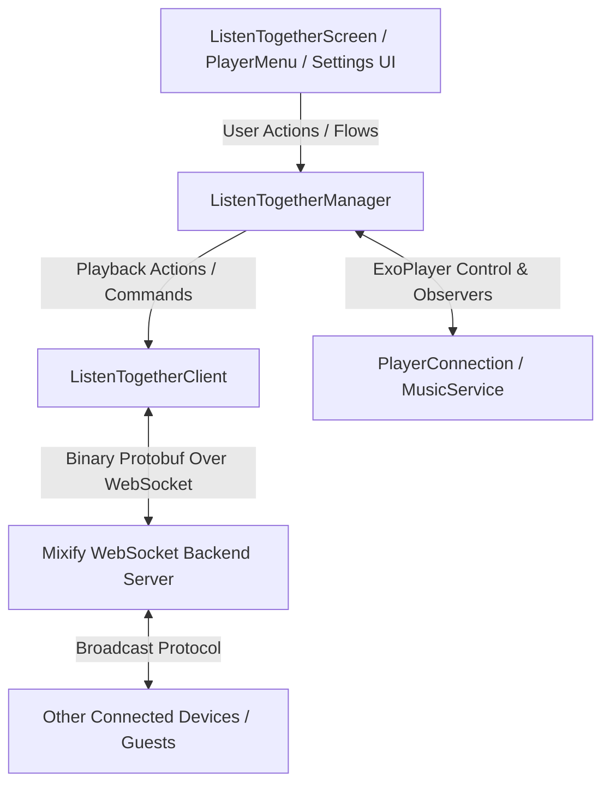
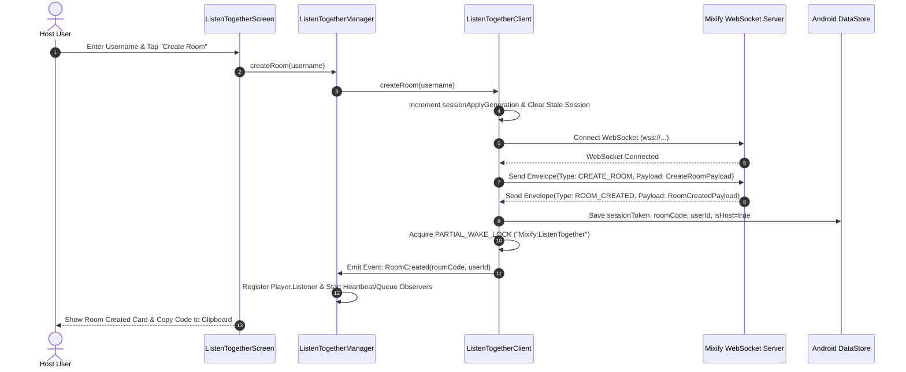
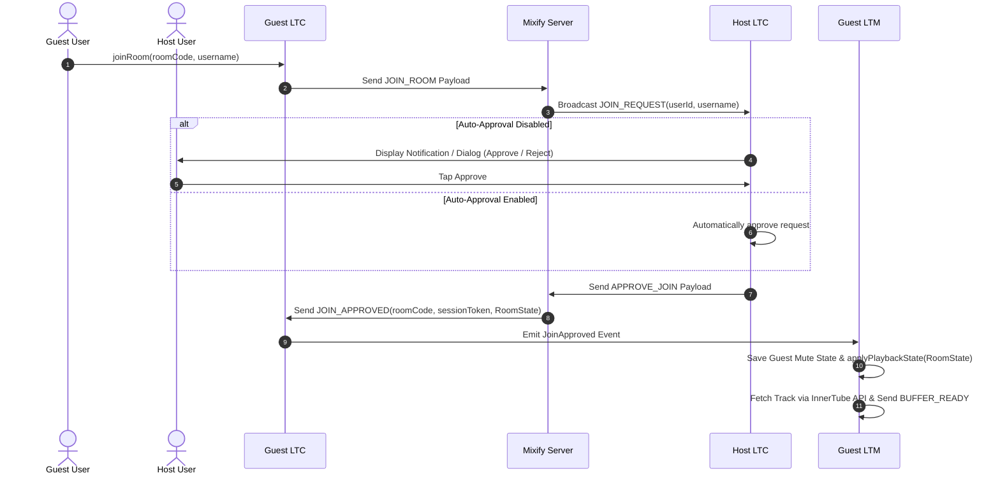
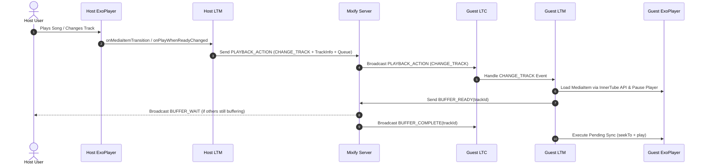
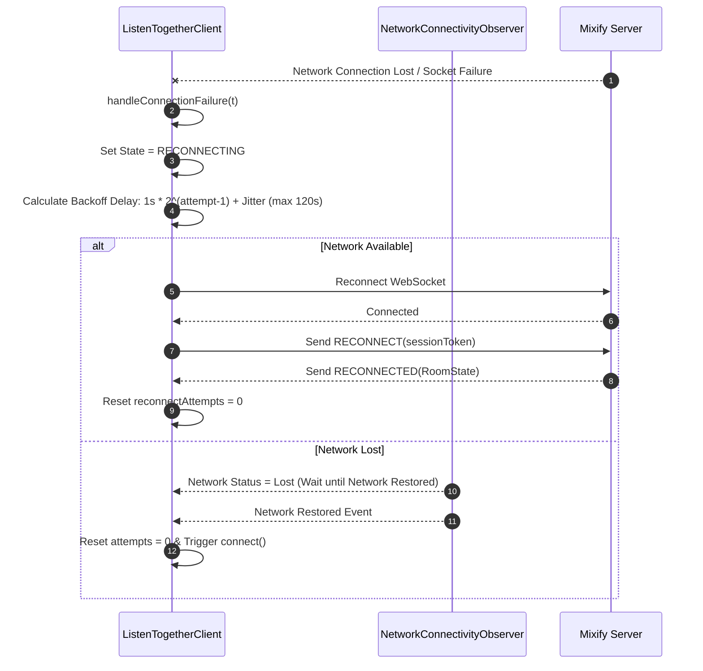

# Listen Together System Documentation — Mixify Android App

Comprehensive, in-depth technical documentation for the **Listen Together** real-time synchronized music playback feature in **Mixify** (Android YTM Client).

---

## 1. Feature Overview (Khabar & Purpose)

**Listen Together** Mixify app ka ek flagship social feature hai jo multiple users ko alag-alag devices par real-time me ek saath music sunne (synchronous playback) ki suvidha deta hai.

### Core Purpose & Functionality
- **Shared Listening Session**: Ek user ("Host") ek virtual room create karta hai aur doosre users ("Guests") room code enter karke us room me join hote hain.
- **Synchronized Music Playback**: Job Host gaana play, pause, seek, track change, ya queue modify karta hai, toh baki sabhi Guests ke devices par same actions automatic execute hote hain.
- **Track Suggestions System**: Guests Host ko gaane suggest kar sakte hain. Host notification ya UI modal se unhe approve ya reject kar sakta hai.
- **Moderation & Administrative Control**: Host kisi bhi user ko kick ya permanently block kar sakta hai, ya kisi Guest ko Host role transfer kar sakta hai.
- **Session Continuity & Recovery**: Disconnection, app backgrounding, ya network loss ke case me automatic exponential backoff reconnection aur session persistence mechanisms active hote hain.

### Room & Roles Concept
1. **Host**:
   - Room ka owner hota hai.
   - Master playback state control karta hai (Play, Pause, Seek, Queue Change, Track Change).
   - Join requests aur Track suggestions ko approve/reject karta hai.
   - Moderation actions (Kick, Block, Transfer Host) perform kar sakta hai.
2. **Guest**:
   - Host ke room me join hone wala listener hota is room.
   - Playback control locked hota hai (Manual play/pause/skip block hota hai listener dwara).
   - Host ke state updates ko receive karke apne local ExoPlayer me sync karta hai.
   - Tracks suggest kar sakta hai Host ko.

### Real-Time vs Approximate Synchronization
- **WebSocket Protocol**: Sub-second low-latency real-time binary communication powered by **Google Protocol Buffers (Protobuf)**.
- **Buffer Protocol**: Naye track load hone par, Sabhi guests gaana download/load karne ke baad `BUFFER_READY` payload bhejte hain. Host/Server sabhi ke ready hone ka wait karta hai (`BUFFER_WAIT`) aur fir `BUFFER_COMPLETE` broadcast karke ek saath music start karwata hai.
- **Clock Synchronization & Drift Correction**: `PING`/`PONG` round-trip time estimation dwara Server Clock ke saath client time align kiya jata hai.
  - **Soft Drift (50ms - 750ms)**: Playback speed ko subtle ±2% adjust (`DRIFT_CORRECTION_SPEED = 0.02f`) karke drift fix kiya jata hai bina audio pitch ruin kiye.
  - **Hard Drift (≥ 750ms)**: Explicit `seekTo()` execution hota hai.

---

## 2. Source Code Architecture & File Map

Listen Together subsystem modern Android Jetpack practices, Hilt Dependency Injection, Kotlin Coroutines, Kotlin Flow (`StateFlow`/`SharedFlow`), Media3 (ExoPlayer), aur OkHttp WebSocket par built hai.

### Complete File Matrix

| Component File Path | Core Role & Responsibilities | Key Classes / Interfaces | Major Dependencies |
|---|---|---|---|
| `app/src/main/proto/listentogether.proto` | Protocol Buffer definitions for network payloads and envelopes. | `Envelope`, `RoomState`, `TrackInfo`, `PlaybackActionPayload`, `SyncStatePayload` | Google Protobuf Compiler |
| `app/src/main/kotlin/com/mixify/music/listentogether/ListenTogetherClient.kt` | Low-level WebSocket network engine, Protobuf codec, reconnection logic, notification handling, and session storage. | `ListenTogetherClient`, `ConnectionState`, `RoomRole`, `ListenTogetherEvent` | OkHttp WebSocket, Protobuf, DataStore, NetworkConnectivityObserver |
| `app/src/main/kotlin/com/mixify/music/listentogether/ListenTogetherManager.kt` | High-level business bridge connecting WebSocket client with ExoPlayer (`PlayerConnection`). Controls playback sync, drift correction, queue management, and volume observation. | `ListenTogetherManager`, `canonicalPlaybackQueue`, `shouldSeekDuringActivePlayback` | `ListenTogetherClient`, `PlayerConnection`, Media3 ExoPlayer, InnerTube API |
| `app/src/main/kotlin/com/mixify/music/listentogether/ListenTogetherServers.kt` | Manages predefined and custom WebSocket server endpoints. | `ListenTogetherServers`, `ListenTogetherServer` | Kotlinx Serialization |
| `app/src/main/kotlin/com/mixify/music/listentogether/ListenTogetherActionReceiver.kt` | Android `BroadcastReceiver` handling notification action clicks (Approve/Reject Join, Approve/Reject Suggestion). | `ListenTogetherActionReceiver` | NotificationManagerCompat, `ListenTogetherClient` |
| `app/src/main/kotlin/com/mixify/music/ui/screens/ListenTogetherScreen.kt` | Main UI Screen for Listen Together (Room creation, joining, connected users list, host controls, join/suggestion requests). | `ListenTogetherScreen`, `RoomStatusCard`, `ConnectedUsersSection` | Jetpack Compose, `LocalListenTogetherManager` |
| `app/src/main/kotlin/com/mixify/music/ui/screens/settings/integrations/ListenTogetherSettings.kt` | Integrations & Settings screen for server URL customization, username configuration, auto-approval toggles, debug logs. | `ListenTogetherSettings`, `ServerChooserDialog` | Jetpack Compose, DataStore |
| `app/src/main/kotlin/com/mixify/music/playback/PlayerConnection.kt` | ExoPlayer wrapper & playback interface. Implements `shouldBlockPlaybackChanges` callback to prevent Guest manual overrides. | `PlayerConnection` | Media3 ExoPlayer, MediaBrowserCompat |
| `app/src/main/kotlin/com/mixify/music/playback/MusicService.kt` | Background Media Library Service. Injects `ListenTogetherManager` and binds it to playback lifecycle. | `MusicService` | MediaLibraryService, Hilt |
| `app/src/main/kotlin/com/mixify/music/ui/menu/PlayerMenu.kt` | Player bottom sheet menu containing Listen Together status, sync request button, moderation, host transfer, leave room options. | `PlayerMenu` | Jetpack Compose |
| `app/src/main/kotlin/com/mixify/music/di/AppModule.kt` | Hilt DI module providing singleton instances of `ListenTogetherClient` and `ListenTogetherManager`. | `AppModule` | Hilt (`@Singleton`, `@Provides`) |
| `app/src/main/kotlin/com/mixify/music/MainActivity.kt` | Binds `PlayerConnection` to `ListenTogetherManager`, initializes composition locals, handles lifecycle disconnects/reconnects. | `MainActivity` | `LocalListenTogetherManager` |

---

## 3. Complete Architecture & Communication Flow

### System Architecture Overview



### Data Flow Diagram

```
[ Android UI ]
      │
      ▼ (Calls createRoom/joinRoom/suggestTrack)
[ ListenTogetherManager ]
      │
      ▼ (Encodes Protobuf & Sends Envelope)
[ ListenTogetherClient ]
      │
      ▼ (OkHttp WSS binary socket)
[ Mixify Server (wss://metroserverx.meowery.eu/ws) ]
      │
      ▼ (Protobuf Broadcast)
[ Remote Clients / Guests ]
      │
      ▼ (Decodes & Triggers Event)
[ Guest ListenTogetherManager ]
      │
      ▼ (Media3 ExoPlayer Commands: seekTo/play/pause)
[ ExoPlayer / PlayerConnection ]
```

### Detailed Sequence Flow Diagrams

#### 1. Room Creation Flow



#### 2. Room Joining Flow (With Approval)



#### 3. Playback Synchronization & Buffer Flow



#### 4. Disconnection & Exponential Backoff Reconnection Flow



---

## 4. Room Creation, Joining, and Lifecycle Mechanics

### Room Creation Step-by-Step
1. User enters username in `ListenTogetherScreen` or `ListenTogetherSettings` dialog and taps **Create Room**.
2. `ListenTogetherManager.createRoom(username)` triggers `ListenTogetherClient.createRoom(username)`.
3. `sessionApplyGeneration` counter increment hota hai taaki pichli stale disk sessions current action ko overwrite na karein.
4. Active session tokens aur local room states clear hote hain (`clearPersistedSession()`).
5. Connection check: Agar WebSocket connected hai toh direct `CREATE_ROOM` Protobuf message send hota hai; agar disconnected hai toh `PendingAction.CreateRoom` set karke `connect()` execute hota hai.
6. Server unique 8-character `room_code`, `user_id`, aur `session_token` generate karke `ROOM_CREATED` payload return karta hai.
7. Client session DataStore me save karta hai, `WakeLock` (`Mixify:ListenTogether`, partial wake lock) acquire karta hai, room code clipboard par copy karta hai, aur global Toast display karta hai.
8. `ListenTogetherManager` ExoPlayer ke `Player.Listener` ko register karta hai, heartbeat loop (every 8s) start karta hai, aur queue/volume observers start karta hai.

### Room Joining Step-by-Step
1. User 8-digit room code aur username enter karta hai.
2. Client uppercase `roomCode` aur `username` ke saath `JOIN_ROOM` payload send karta hai.
3. Server Host ko `JOIN_REQUEST` message bhejta hai.
4. **Host Handling**:
   - Agar user Host ki blocked list (`_blockedUsernames`) me hai, toh request silently reject ho jati hai (`rejectJoin(userId, "You are blocked")`).
   - Agar `ListenTogetherAutoApprovalKey` preference `true` hai, toh Host app automatically request approve kar deta hai.
   - Otherwise, Host ko High-Priority Android Notification (`ListenTogetherActionReceiver`) aur UI Dialog dikhaya jata hai jisme **Approve** aur **Reject** buttons hote hain.
5. Approval par server Guest ko `JOIN_APPROVED` payload ke sath poora `RoomState` (Current track, Playback position, Queue, IsPlaying state, Server timestamp, Revision ID) bhejta hai.
6. Guest app session token store karta hai, `WakeLock` acquire karta hai, aur `applyPlaybackState()` execute karta hai.

### Room Persistence & Session Grace Period
- **Grace Period**: `SESSION_GRACE_PERIOD_MS = 10 * 60 * 1000L` (10 Minutes).
- When app restart hoti hai, `init` block me `loadPersistedSession()` run hota hai. Agar token 10 minute se purana nahi hai, toh automatic session restore hoke reconnection pipeline activate hoti hai.
- Temporary network drops par exponential backoff retry active rehta hai (Up to 15 attempts).

---

## 5. Music Playback Synchronization Protocol

### Synchronization Mechanics

```
Host Event -> Player.Listener -> sendPlaybackAction() -> Server -> Broadcast -> Guest handlePlaybackSync() -> ExoPlayer
```

1. **Track Changes (`CHANGE_TRACK`)**:
   - Host jab naya gaana select karta hai, `sendTrackChangeInternal()` execute hota hai jo track metadata (ID, Title, Artist, Album, Duration, Thumbnail, SuggestedBy) aur current queue items pack karke `CHANGE_TRACK` action bhejta hai.
   - Guest `CHANGE_TRACK` receive karke `currentTrackGeneration` increment karta hai (stale coroutines cancel karne ke liye) aur InnerTube API se track queue fetch karta hai.

2. **Buffer Protocol (`BUFFER_READY` / `BUFFER_WAIT` / `BUFFER_COMPLETE`)**:
   - Guest jab naya gaana prepare/load kar leta hai, player ko pause state me rakh kar server ko `BUFFER_READY(trackId)` bhejta hai.
   - Server sabhi connected guests ke buffer hone ka wait karta hai (`BUFFER_WAIT`).
   - Jaise hi saare users ready hote hain, server `BUFFER_COMPLETE` broadcast karta hai.
   - Guest `BUFFER_COMPLETE` receive hote hi apne stored `pendingSyncState` ko execute karta hai (seekTo + play).

3. **Time Latency Estimation & Clock Alignment (`ServerClock`)**:
   - Client Har 25 seconds me `PING` payload bhejta hai (Sequence ID aur Client Timestamp ke saath).
   - Server `PONG` return karta hai jisme `clientTime`, `serverReceiveTime`, aur `serverSendTime` hote hain.
   - `ServerClock` latency (RTT / 2) aur clock offset calculate karta hai.
   - `positionAtServerTime()` function guest ke delay ko count karke exact current playback position adjust karta hai:
     $$\text{Adjusted Position} = \text{Base Position} + (\text{Current Server Time} - \text{Event Server Time})$$

4. **Drift Correction Engine**:
   - `DRIFT_CHECK_INTERVAL_MS = 250ms`.
   - **Soft Sync Threshold (`SOFT_SYNC_THRESHOLD_MS = 50ms`)**: Drift agar 50ms se kam hai, toh audio perfectly in-sync mana jata hai.
   - **Pitch-Preserving Speed Shift**: Drift agar 50ms aur 750ms ke beech hai, toh `ExoPlayer.setPlaybackParameters()` se speed ko `1.02x` ya `0.98x` (`DRIFT_CORRECTION_SPEED = 0.02f`) set karke bina audio jump kiye smooth drift fix kiya jata hai.
   - **Hard Sync Threshold (`HARD_SYNC_THRESHOLD_MS = 750ms`)**: Drift agar 750ms se zyada hai, toh direct `seekTo()` perform hota hai.

5. **Revision Counter & Conflict Resolution**:
   - Har playback message me ek monotonically increasing `uint64 revision` ID hoti hai.
   - Both `ListenTogetherClient` and `ListenTogetherManager` incoming messages ka revision compare karte hain (`acceptPlaybackRevision()`). Agar incoming revision < `lastAppliedRevision`, toh stale / out-of-order message immediate discard ho jata hai.

---

## 6. Host and Guest Permission Matrix

| Operation / Feature | Host Permission | Guest Permission | Implemented Status | Code Evidence / Reference |
|---|---|---|---|---|
| **Play / Pause** | Allowed | Restricted (Blocked) | Implemented | `PlayerConnection.shouldBlockPlaybackChanges = { isInRoom && !isHost }` |
| **Seek Position** | Allowed | Restricted (Blocked) | Implemented | `ListenTogetherManager.kt` (`onPositionDiscontinuity`) |
| **Skip Next / Previous** | Allowed | Restricted (Blocked) | Implemented | `PlayerConnection.kt` (`onSkipNext`, `onSkipPrevious`) |
| **Change Queue / Clear Queue** | Allowed | Restricted (Blocked) | Implemented | `ListenTogetherManager.kt` (`startQueueSyncObservation`) |
| **Suggest Tracks** | Restricted (Host direct plays) | Allowed | Implemented | `ListenTogetherClient.kt` (`suggestTrack()`) |
| **Approve / Reject Suggestions** | Allowed | Restricted | Implemented | `ListenTogetherClient.kt` (`approveSuggestion()`, `rejectSuggestion()`) |
| **Approve / Reject Join Requests** | Allowed | Restricted | Implemented | `ListenTogetherClient.kt` (`approveJoin()`, `rejectJoin()`) |
| **Kick User** | Allowed | Restricted | Implemented | `ListenTogetherClient.kt` (`kickUser()`) |
| **Block User (Permanent)** | Allowed | Restricted | Implemented | `ListenTogetherClient.kt` (`blockUser()`) |
| **Transfer Host Role** | Allowed | Restricted | Implemented | `ListenTogetherClient.kt` (`transferHost()`) |
| **Sync Host Volume** | Controls Master Vol | Receives (if enabled) | Implemented | `ListenTogetherManager.kt` (`startVolumeSyncObservation()`) |
| **Leave Room** | Allowed | Allowed | Implemented | `ListenTogetherClient.kt` (`leaveRoom()`) |
| **Request Re-sync** | N/A (Is Host) | Allowed | Implemented | `ListenTogetherManager.kt` (`requestSync()`) |

---

## 7. Backend, APIs, and Networking Overview

### Transport Layer & Protocol
- **Transport**: WebSockets (`OkHttpClient.newWebSocket()`).
- **Endpoint Sourcing**: Sourced from `ListenTogetherServers.kt` or user custom setting in DataStore (`ListenTogetherServerUrlKey`).
- **Default Server**: `wss://metroserverx.meowery.eu/ws` (Operator: Nyx).
- **Serialization Format**: Binary Google Protocol Buffers (Protobuf).
- **Gzip Compression**: `Envelope` message features `bool compressed = 3;` flag for compressing large queue payloads.

### Network Message Types (`listentogether.proto`)

```protobuf
message Envelope {
  string type = 1;
  bytes payload = 2;
  bool compressed = 3;
}
```

- **Client $\rightarrow$ Server**: `CREATE_ROOM`, `JOIN_ROOM`, `LEAVE_ROOM`, `APPROVE_JOIN`, `REJECT_JOIN`, `PLAYBACK_ACTION`, `PING`, `BUFFER_READY`, `KICK_USER`, `TRANSFER_HOST`, `SUGGEST_TRACK`, `APPROVE_SUGGESTION`, `REJECT_SUGGESTION`, `RECONNECT`.
- **Server $\rightarrow$ Client**: `ROOM_CREATED`, `JOIN_REQUEST`, `JOIN_APPROVED`, `JOIN_REJECTED`, `USER_JOINED`, `USER_LEFT`, `BUFFER_WAIT`, `BUFFER_COMPLETE`, `ERROR`, `HOST_CHANGED`, `KICKED`, `SYNC_STATE`, `PONG`, `RECONNECTED`, `USER_RECONNECTED`, `USER_DISCONNECTED`, `SUGGESTION_RECEIVED`.

### Connection Failovers & Network Observer
- **Exponential Backoff Formula**:
  $$\text{Delay} = \min\left(\text{INITIAL\_DELAY} \times 2^{(\text{attempt} - 1)}, \text{MAX\_DELAY}\right) + \text{Jitter}$$
  - `INITIAL_RECONNECT_DELAY_MS = 1000ms` (1 second).
  - `MAX_RECONNECT_DELAY_MS = 120000ms` (2 minutes).
  - `MAX_RECONNECT_ATTEMPTS = 15`.
  - Jitter: 0% se 20% random variation thundering herd problem prevent karne ke liye.
- **NetworkConnectivityObserver**: Android `ConnectivityManager.NetworkCallback` utilize karta hai. Jab internet disconnect hoke wapas aata hai, reconnection attempts reset `0` hoke instant reconnect initiate hota hai.

---

## 8. Database and Storage Layer

Listen Together features zero local SQL database overhead, relying purely on **Android Jetpack DataStore (Preferences)** for persistent state and Kotlin **StateFlow** for reactive runtime state.

### DataStore Keys Reference (`com.mixify.music.constants`)

| Preference Key Name | Type | Purpose / Description |
|---|---|---|
| `ListenTogetherServerUrlKey` | `String` | Currently selected WebSocket server URL (`wss://...`). |
| `ListenTogetherUsernameKey` | `String` | User's display name in rooms. |
| `ListenTogetherSessionTokenKey` | `String` | Auth session token issued by backend server for reconnection. |
| `ListenTogetherRoomCodeKey` | `String` | Currently active 8-character room code. |
| `ListenTogetherUserIdKey` | `String` | Unique user ID assigned by server. |
| `ListenTogetherIsHostKey` | `Boolean` | Whether user was Host in saved session. |
| `ListenTogetherSessionTimestampKey` | `Long` | Epoch timestamp when session was last active (used for 10-min expiration check). |
| `ListenTogetherAutoApprovalKey` | `Boolean` | Preference to auto-approve guest join requests. |
| `ListenTogetherAutoApproveSuggestionsKey` | `Boolean` | Preference to auto-approve guest track suggestions. |
| `ListenTogetherSyncVolumeKey` | `Boolean` | Preference to synchronize volume with Host. |
| `ListenTogetherBlockedUsersKey` | `String` (JSON List) | JSON list of permanently blocked usernames. |

---

## 9. Error Handling and Edge Cases Analysis

### Scenario Analysis & Code Responses

1. **Internet Disconnection**:
   - `NetworkConnectivityObserver` detects loss. WebSocket status updates to `DISCONNECTED`.
   - Reconnection pipeline kicks in with exponential backoff (up to 15 attempts). When internet returns, auto-reconnect triggers immediately.

2. **Host Unexpectedly Disconnects / App Kicked**:
   - Server sends `USER_DISCONNECTED` to guests.
   - Agar Host return nahi karta, server `HOST_CHANGED` payload dwara nayi Host assign karta hai.
   - Host `ListenTogetherManager` `USER_DISCONNECTED` and `HOST_CHANGED` handling logic through StateFlow updates automatically updates UI and guest permissions.

3. **Background Idle Disconnect Policy**:
   - `evaluateBackgroundDisconnectPolicy()` checks if app is in background (`ProcessLifecycleOwner.get().lifecycle.currentState < STARTED`).
   - Agar user room me nahi hai aur pichle 30 minutes se idle hai (`BACKGROUND_DISCONNECT_DELAY_MS = 30 mins`), battery aur network resources save karne ke liye WebSocket disconnect ho jata hai.
   - Room me rehte waqt `WakeLock` (`Mixify:ListenTogether`) aur Ping Timer (every 25s) CPU throttling aur socket degradation prevent karte hain.

4. **App Force-Closed / Process Killed**:
   - Persistent session DataStore me stored rehta hai.
   - Re-open karne par agar session age < 10 minutes (`SESSION_GRACE_PERIOD_MS`), client automatically `RECONNECT` payload bhej kar active room state regain kar leta hai.

5. **Track Unavailable on Guest Device**:
   - InnerTube API queue resolution fail hone par `onFailure` block log report karta hai, player internal sync bypass flag reset kar deta hai, aur error state emit karta hai.

---

## 10. Performance and Security Review

### Performance Findings
- **WakeLock Management**: `acquireWakeLock()` executes `PARTIAL_WAKE_LOCK` with 10-minute timeout, which is explicitly released and re-acquired every 25s ping cycle. This guarantees zero socket degradation when screen is off during long listening sessions.
- **Memory Management**: `ListenTogetherManager.cleanup()` explicitly removes `Player.Listener`, cancels coroutine jobs (`driftCorrectionJob`, `queueMutationJob`, `heartbeatJob`, `volumeObserverJob`), and releases WakeLocks to prevent memory leaks.
- **Debouncing & Generation Guards**: Rapid playback slider seeks aur track change race conditions ko avoid karne ke liye `currentTrackGeneration` and `queueSyncGeneration` integers maintain kiye gaye hain.

### Security Findings

| Category | Finding Status | Details & Risk Level | Mitigation in Code |
|---|---|---|---|
| **Auth Credentials** | Confirmed Safe | Code contains no hardcoded secrets or passwords. Endpoint uses standard `wss://`. | `ListenTogetherServers.kt` |
| **Room Code Privacy** | Potential Risk (Low) | 8-character room codes are random string tokens. | Code auto-copies on creation; host can kick unauthorized users. |
| **User Blocking & Privacy** | Confirmed Safe | Blocked users list stored locally in encrypted DataStore. Blocked join requests silently rejected. | `ListenTogetherClient.kt` (`blockUser()`) |
| **Input Validation** | Confirmed Safe | Room code sanitized to `.uppercase()`, track IDs trimmed before buffer signaling. | `ListenTogetherClient.kt` (`sendBufferReady()`) |

---

## 11. Complete Function Reference Table

### Major Function Reference

| Component File | Function Name | Purpose / Action | Called By | Main Inputs | Main Outputs |
|---|---|---|---|---|---|
| `ListenTogetherClient` | `connect()` | Opens WebSocket connection to server URL | `ListenTogetherManager`, UI | None | Unit (Updates `connectionState`) |
| `ListenTogetherClient` | `createRoom()` | Sends `CREATE_ROOM` request to server | `ListenTogetherManager` | `username: String` | Unit (Emits `RoomCreated` event) |
| `ListenTogetherClient` | `joinRoom()` | Sends `JOIN_ROOM` request to server | `ListenTogetherManager` | `roomCode: String, username: String` | Unit (Emits `JoinApproved`/`JoinRejected`) |
| `ListenTogetherClient` | `sendPlaybackAction()` | Encodes & sends `PLAYBACK_ACTION` Protobuf | `ListenTogetherManager` | `action: String, trackId, position, queue, volume...` | Unit |
| `ListenTogetherClient` | `sendBufferReady()` | Signals guest buffering complete | `ListenTogetherManager` | `trackId: String` | Unit |
| `ListenTogetherClient` | `approveJoin()` | Host approves guest join request | `ListenTogetherManager`, Receiver | `userId: String` | Unit |
| `ListenTogetherClient` | `kickUser()` | Host kicks participant | `ListenTogetherManager`, UI | `userId: String, reason: String?` | Unit |
| `ListenTogetherClient` | `blockUser()` | Permanently blocks user locally | `ListenTogetherManager`, UI | `username: String` | Unit |
| `ListenTogetherManager` | `setPlayerConnection()` | Binds ExoPlayer instance to Manager | `MainActivity`, `MusicService` | `connection: PlayerConnection?` | Unit |
| `ListenTogetherManager` | `handlePlaybackSync()` | Applies host sync commands to local player | `ListenTogetherClient` Event Collector | `action: PlaybackActionPayload` | Unit (Modifies ExoPlayer) |
| `ListenTogetherManager` | `startDriftCorrection()` | Evaluates and corrects audio drift | `handlePlaybackSync()` | `connection, trackId, position, serverTime` | Unit (Adjusts speed / seeks) |
| `ListenTogetherManager` | `suggestTrack()` | Guest submits track suggestion | UI / Menus | `trackInfo: TrackInfo` | Unit |
| `ListenTogetherManager` | `requestSync()` | Manually requests full state sync | Player Menu / UI | None | Unit |

---

## 12. End-to-End Practical Example Walkthrough

Let's walk through a complete real-world scenario step-by-step:

1. **User A (Host) Room Creation**:
   - User A opens Listen Together screen, enters "Aman" and taps **Create Room**.
   - `LTM.createRoom("Aman")` $\rightarrow$ `LTC.createRoom("Aman")`.
   - Client WebSocket connects to `wss://metroserverx.meowery.eu/ws` and sends `CREATE_ROOM`.
   - Server returns `ROOM_CREATED` with room code `MIX892KL` and `sessionToken`.
   - Clipboard gets `MIX892KL`. ExoPlayer listener registered on Host device.

2. **User B (Guest) Joins Room**:
   - User B enters `MIX892KL` and "Rahul", taps **Join**.
   - `LTC` sends `JOIN_ROOM` payload.
   - Server sends `JOIN_REQUEST` to Aman.
   - Aman gets notification: *"Rahul wants to join"*. Aman taps **Approve**.
   - `ListenTogetherActionReceiver` catches broadcast and calls `client.approveJoin("user_b_id")`.
   - Server sends `JOIN_APPROVED` with full `RoomState` to Rahul.

3. **Aman Plays a Song**:
   - Aman clicks on a track "Starboy".
   - Host `Player.Listener.onMediaItemTransition` fires $\rightarrow$ sends `PLAYBACK_ACTION(CHANGE_TRACK, trackInfo, queue)`.
   - Rahul's device receives `CHANGE_TRACK`.
   - Rahul's `ListenTogetherManager` fetches media queue via `YouTube.queue()`, loads track into ExoPlayer in paused state, and sends `BUFFER_READY("starboy_id")`.
   - Server receives buffer ready and broadcasts `BUFFER_COMPLETE("starboy_id")`.
   - Rahul's app receives `BUFFER_COMPLETE` and executes stored `pendingSyncState` (seeks to position 0 and starts playback).

4. **Aman Seeks to 1:30**:
   - Aman drags seekbar to `01:30` (90,000ms).
   - Host `Player.Listener.onPositionDiscontinuity` (reason `SEEK`) fires $\rightarrow$ sends `PLAYBACK_ACTION(SEEK, position=90000)`.
   - Rahul's device receives `SEEK`. `handlePlaybackSync` calculates latency offset via `ServerClock` and executes `connection.seekTo(adjustedPos)`.

5. **Rahul Suggests a Song**:
   - Rahul opens Song Menu on a song "Blinding Lights" and selects **Suggest to Host**.
   - `LTM.suggestTrack(trackInfo)` sends `SUGGEST_TRACK` payload.
   - Aman receives `SUGGESTION_RECEIVED` notification. Aman clicks **Approve**.
   - Server adds "Blinding Lights" to queue and broadcasts `QUEUE_ADD`.

6. **Rahul Temporarily Loses Network & Reconnects**:
   - Rahul enters elevator, network drops.
   - `NetworkConnectivityObserver` detects drop. Connection state becomes `RECONNECTING`.
   - When Rahul exits elevator, network recovers. `NetworkConnectivityObserver` triggers reconnect.
   - Client sends `RECONNECT(sessionToken)`.
   - Server sends `RECONNECTED(RoomState)`. Rahul's playback syncs seamlessly back to Aman's position!

---

## 13. Troubleshooting & Debugging Guide

### Recommended Logcat Search Tags
```bash
# Filter for Listen Together Client logs
adb logcat -s ListenTogether

# Filter for Listen Together Manager logs
adb logcat -s ListenTogetherManager

# Combined filter command
adb logcat | grep -E "ListenTogether|ListenTogetherManager"
```

### Common Issues & Diagnostic Steps

1. **Room Creation Fails / Hanging in Connecting State**:
   - **Check**: Server URL validity in Settings -> Integrations -> Listen Together.
   - **Fix**: Revert to default server `wss://metroserverx.meowery.eu/ws` or test WebSocket connection via network inspector.

2. **Guest Playback Out of Sync / Audio Jumps**:
   - **Check**: Logcat for `[SYNC]` logs and `ServerClock` latency output.
   - **Fix**: Open Player Menu and tap **Request Re-sync** button to force clean `SyncStatePayload` fetch.

3. **Join Request Notifications Not Appearing**:
   - **Check**: Notification permissions (`POST_NOTIFICATIONS` on Android 13+) and `ListenTogetherAutoApprovalKey` preference.
   - **Fix**: Enable notification permission or turn on Auto-Approval in Listen Together Settings.

---

## 14. Known Limitations and Future Improvements

### Confirmed Existing Limitations
1. **Server Reliance**: Requires an active external WebSocket backend (`mixifyserver`).
2. **YouTube Video Availability**: If a YouTube video is region-restricted or unavailable on a Guest's IP, playback for that track will fail on the Guest device.
3. **Local Audio Files**: Local device MP3/FLAC files cannot be synced across rooms since media is resolved via YouTube ID.

### Recommended Future Enhancements
- [ ] Peer-to-Peer (WebRTC) fallback for direct local network sync without external server.
- [ ] In-room live text/voice chat between Host and Guests.
- [ ] Multi-Host / Collaborative room permission modes.

---

## 15. Developer Quick Reference

- **Core Entry Point**: `com.mixify.music.listentogether.ListenTogetherManager`
- **Networking Engine**: `com.mixify.music.listentogether.ListenTogetherClient`
- **Proto Schema**: `app/src/main/proto/listentogether.proto`
- **Main UI Screen**: `com.mixify.music.ui.screens.ListenTogetherScreen`
- **Composition Local**: `LocalListenTogetherManager.current`
- **Default Server**: `wss://metroserverx.meowery.eu/ws`
