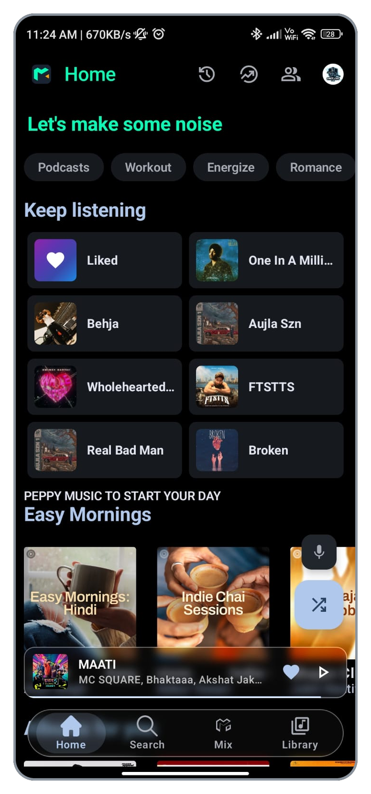
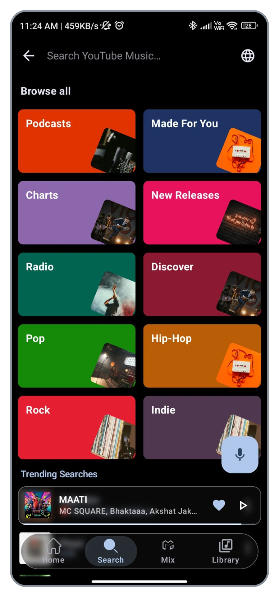
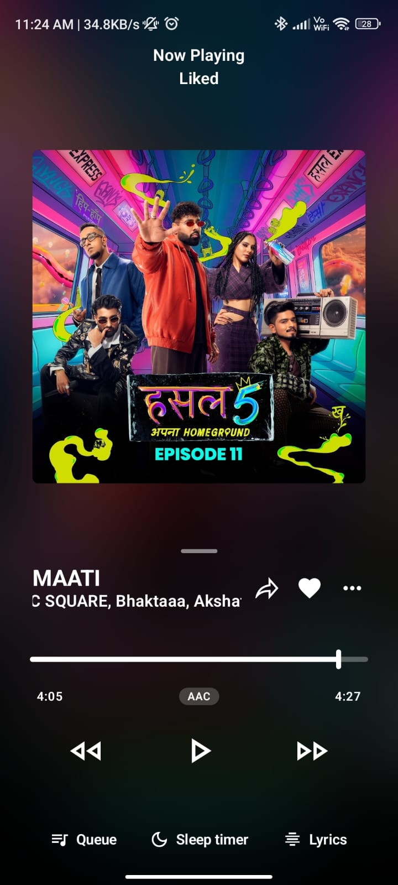
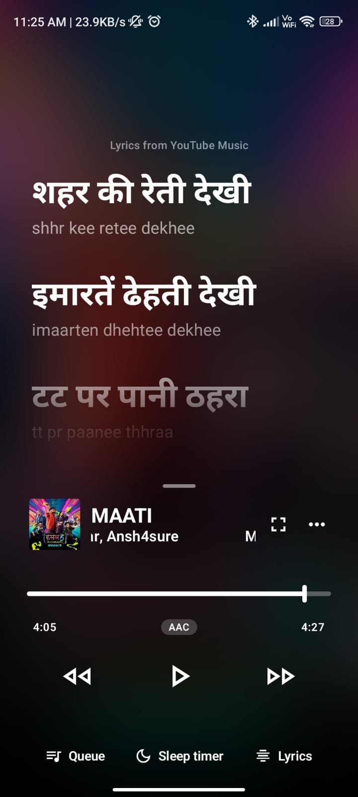
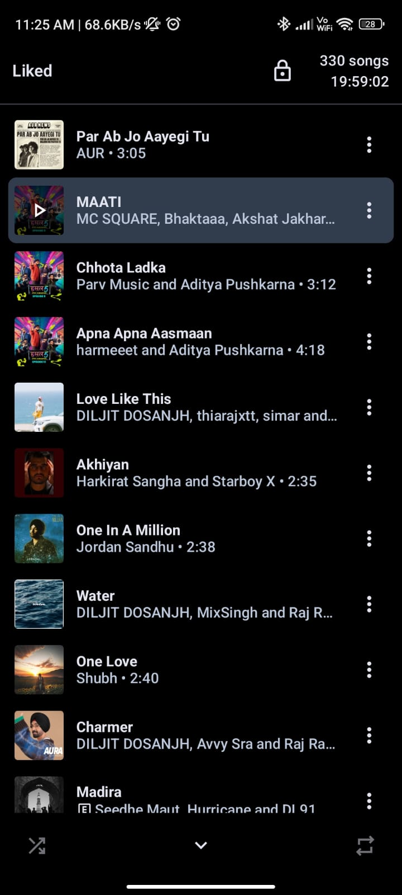
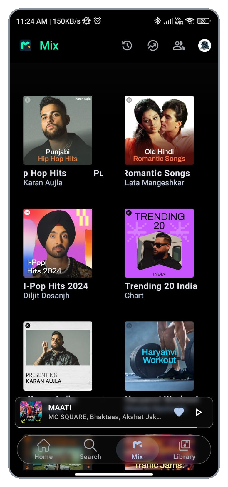

<div align="center">


# Mixify

### A modern music experience for Android

<br/>

[](https://github.com/scisims12/Mixify/releases/latest)
[](https://github.com/scisims12/Mixify/releases)
[](#)

<br/>

[](https://t.me/mixify20)

<br/>

[**Download**](#download-now) ·
[**Features**](#features) ·
[**Screenshots**](#screenshots) ·
[**Installation**](#installation) ·
[**FAQ**](#faq) ·
[**Telegram**](https://t.me/mixify20)

</div>

---

<div align="center">

## About Mixify

**Mixify** is a modern Android music application designed for a fast, smooth and enjoyable listening experience.

It brings together music playback, smart lyrics, offline listening, playlist management, queue controls, search, and social listening features inside one clean and modern interface.

Mixify focuses on:

**Fast Playback · Smart Lyrics · Offline Music · Premium Quality · Listen Together**

</div>

---

<div align="center">

# Screenshots

<a id="screenshots"></a>





<br/>





</div>

---

<div align="center">

# Features

<a id="features"></a>

<table>
  <tr>
    <td width="50%" valign="top">

### 🎧 Playback

- Fast and smooth music playback
- Background playback
- Queue management
- Offline playback
- Premium audio quality

</td>

<td width="50%" valign="top">

### 🎤 Smart Lyrics

- Smart lyrics experience
- Synced lyrics support
- Clean lyrics interface
- Easy access from the player

</td>
  </tr>

  <tr>
    <td width="50%" valign="top">

### 📚 Library & Playlists

- Playlist management
- Favourite music
- Easy library organization
- Recently played content
- Quick access to saved music

</td>

<td width="50%" valign="top">

### 🔍 Search & Discovery

- Fast music search
- Discover new music
- Browse songs and playlists
- Clean search experience
- Quick music access

</td>
  </tr>

  <tr>
    <td width="50%" valign="top">

### 👥 Listen Together

- Listen with friends
- Shared listening experience
- Social music playback
- Easy session-based listening

</td>

<td width="50%" valign="top">

### 🎨 Interface

- Modern Android interface
- Clean dark design
- Smooth navigation
- Easy playback controls
- Mobile-friendly layout

</td>
  </tr>

  <tr>
    <td width="50%" valign="top">

### 📥 Offline Experience

- Keep supported music available offline
- Convenient access to saved content
- Reduce repeated loading
- Listen when connectivity is limited

</td>

<td width="50%" valign="top">

### ⚡ Performance

- Fast startup
- Responsive controls
- Smooth screen transitions
- Lightweight navigation
- Designed for everyday listening

</td>
  </tr>
</table>

</div>

---

<div align="center">

# Download Now

<a id="download-now"></a>

## Stable Release

<table>
  <tr>
    <th align="center">APKPure</th>
    <th align="center">GitHub</th>
  </tr>

  <tr>
    <td align="center">
      <a href="https://apkpure.com/p/com.mixify.app">
        
      </a>
    </td>

    <td align="center">
      <a href="https://github.com/scisims12/Mixify/releases/latest">
        
      </a>
    </td>
  </tr>
</table>

<br/>

### Latest Stable Version

[](https://github.com/scisims12/Mixify/releases/latest)

<br/>

**Download Mixify from your preferred source.**

[View all GitHub releases](https://github.com/scisims12/Mixify/releases)

</div>

---

<div align="center">

# Installation

<a id="installation"></a>

</div>

### Install from GitHub

1. Open the **Releases** section.
2. Select the latest Mixify release.
3. Download the APK file.
4. Open the downloaded APK.
5. Allow installation from the required source if Android asks.
6. Install Mixify.
7. Open the app and start listening.

### Install from APKPure

1. Open the [Mixify APKPure page](https://apkpure.com/p/com.mixify.app).
2. Download the latest available version.
3. Install the APK.
4. Launch Mixify.

> Always download Mixify from the official GitHub repository or a trusted distribution source.

---

<div align="center">

# Community

Join the Mixify community for updates, release announcements and discussions.

<br/>

<a href="https://t.me/mixify20">
  
</a>

<br/><br/>

**Telegram:** [t.me/mixify20](https://t.me/mixify20)

</div>

---

<div align="center">

# Building From Source

</div>

Mixify can be built using Android Studio.

### Requirements

- Android Studio
- Android SDK
- Gradle
- Java/Kotlin environment required by the project
- Internet connection for dependencies

### Clone the repository

```bash
git clone https://github.com/scisims12/Mixify.git
